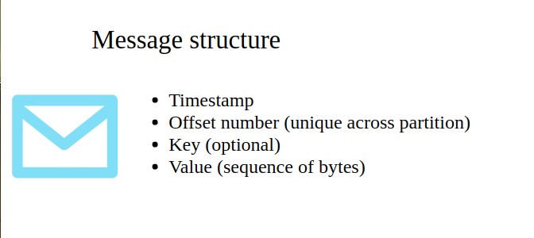
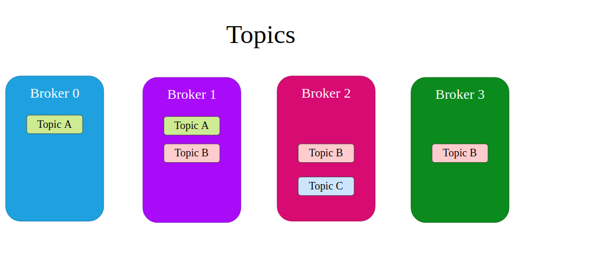
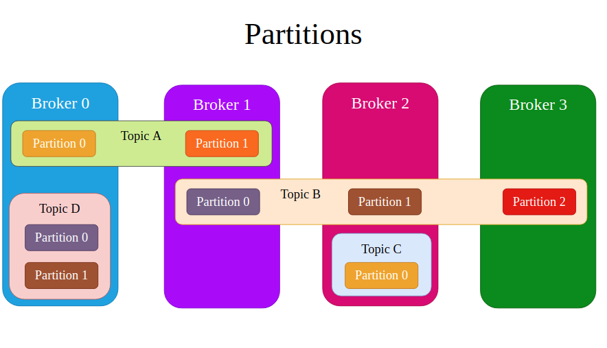
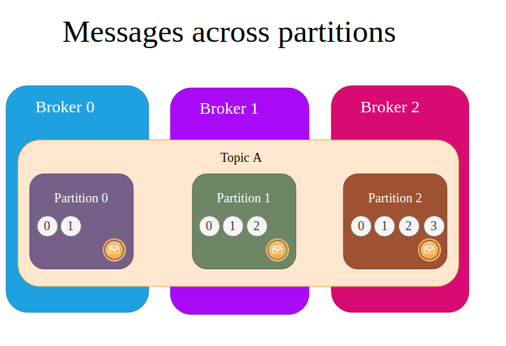
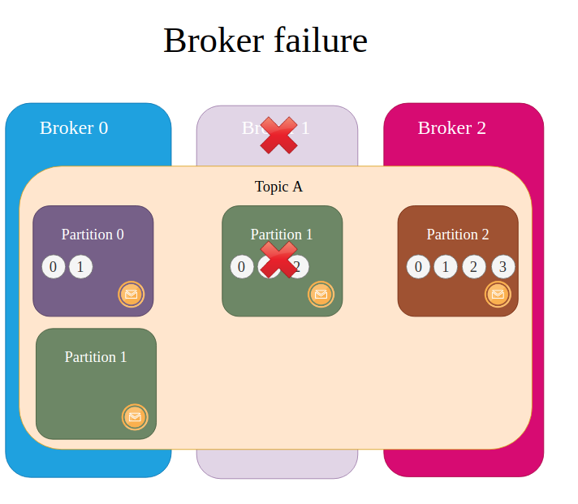
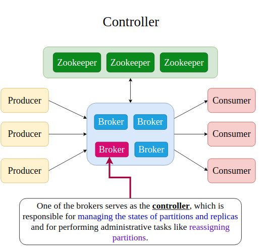
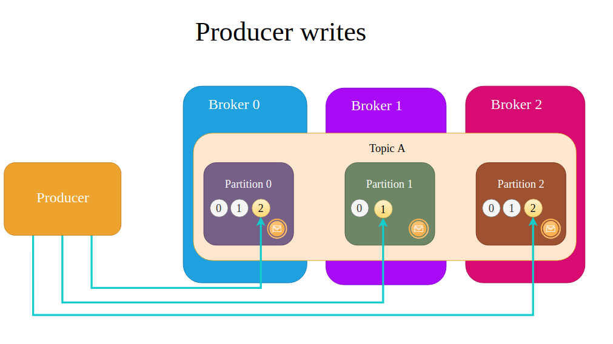
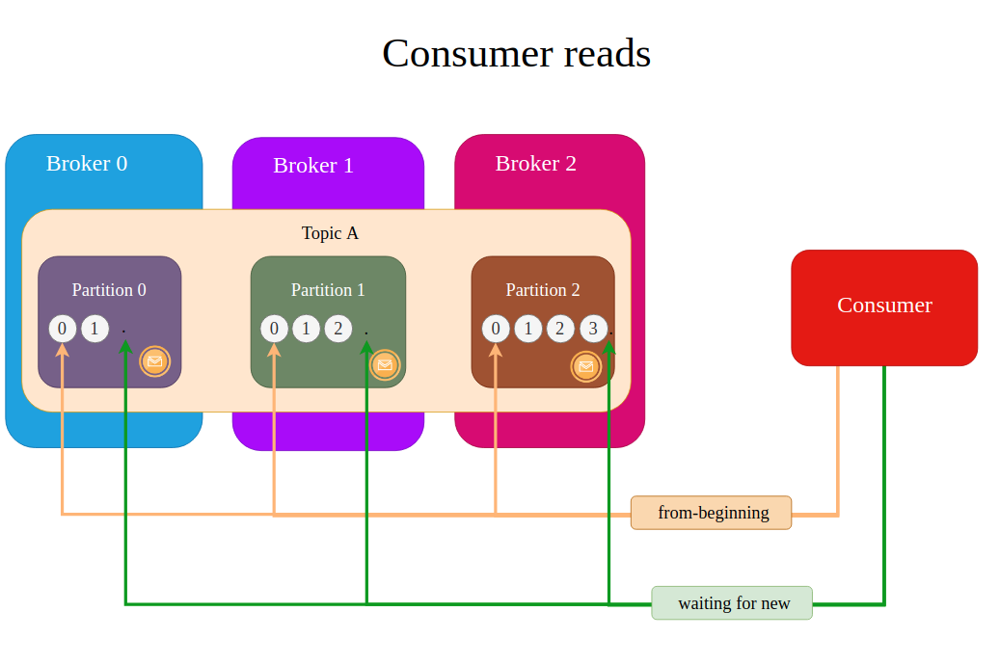

## What is Apache Kafka

YouTube is an example of publish-subscribe messaging system

## Some Basic Commands of Apache Kafka

## Apache Kafka Broker

In every publish subscribe system, message should be stored somewhere. Publishers should be able to send messages and consumers should be able to receive those subscribed messages.

Brokers are responsible for all of these. Publishers in Apache Kafka are called producers and subscribers are called Consumers. There are can multiple Kafka brokers working indepedently. Kafka brokers stores messages in files in hard-drives. There can be multiple producers and multiple consumers as below. 

These Producers and Consumers, produce and receive messages simultaneously. This also makes the Broker single point of failure, if the broker fails then producers and consumers message interaction will not work

Therefore Broker clusters are used.

## Broker Cluster

Multiple Producers and Multiple Consumers can interact with different brokers inside the Broker cluster

One producer can send messages to multiple brokers and hence each  of the broker can store part of the messages

How does the Broker Synchronize and Communicate amongst themseleves inside a Broker Cluster?

## Zookeeper

There is just a single controller in a kafka cluster

## Zookeeper Cluster (ensemble)

It is recommended to have odd number of servers in a zookeeper ensemble.
In every zookeeper cluster, we setup something called quorum , which is the minimum number of servers that should be up and running in order to form operational cluster.

## Multiple Kafka Clusters

Every cluster is a separate entity, however it is possible to have data synchronization between different Kafka Clusters

## Defaiult Kafka and Zookeeper Ports

If multiple zookeepers servers are running on a single computer, three different ports are needed and the same cab be specified by adjusting the configuration files

Same relates to Kafka Brokers

If Brokers should be publicly accessible, we need to adjust "advertised.listeners" property in Broker Config.

## Kafka Topic

Messages are stored by Kafka Brokers by topic. Every topic must have a unique name. Every topic must have a unique name in a kafka cluster.

Every message inside a topic must have a unique number called offset. This number is assigned to every message when it arrives to a specific broker

New messages are always appended to the end of the log. Every record in broker is immutable.
Default log detention period is 168 hours (7 Days)

Kafka Broker is not bothered about consumers whether or not the message is read. Its job is just to store the message and append it at the end of the log.

## Message Structure

Timestamp can be assigned by either Producer or Kafka Broker (it can be configured)
Kafka broker does not care, what is stored inside the message, it just stores the sequence of bytes

Key are created on Producers and send to Kafka brokers. With the help of Key, you can send messages to specific partitions.

## Topic and Partitions

Every topic may exist in different brokers in Kafka cluster. Although Zookeeper is not shown, but it is already there, without zookeeper , Kafka broker is unable to operate. 

Topics are recommended to exist in multiple brokers because of fault tolerance

For example if Broker 0 fails, Broker 1 will still be able to save messages which arrive in Topic A

But how messages for a particular topic are saved, if it exists across multiple brokers. For the same, it uses partition

## Messages across Partitions

If a topic "cities" is created with default configuration (single partition), Broker will create a folder cities-0 for single partition

Offset number of every message is unique in each partition. For example in Partition - 0 of Topic A in Broker - 0 has two messages with offset 0 and 1.

The first message in every parition will have the offset number as 0.

Offset - 0 of Partition 0 is a different message than Offset-0 of Partition - 1

## Partition Leaders and Followers

Followers dont take messages from any producers, neither they send message to any consumer
If Broker 1 fails, one of the Partition 0 in broker 0 and broker 1 will become the new leader.

The message in the leader partition is also replicated in the follower partition

Total number of partitions gets multiplied by the replication factor

## Controller and Its responsibilities

Who decides which Partition will be the partition leader?
Who decides which parition will reside in which broker?
Which Partition gets replicated at which broker

## How Producers writes

## How Consumers read messages

