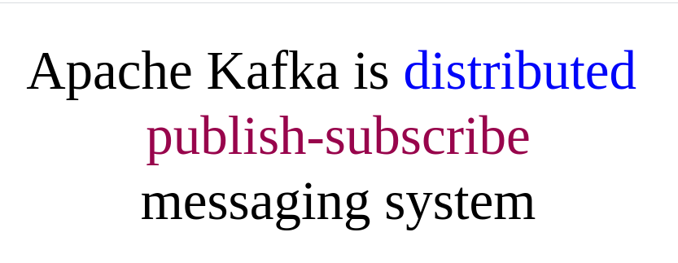
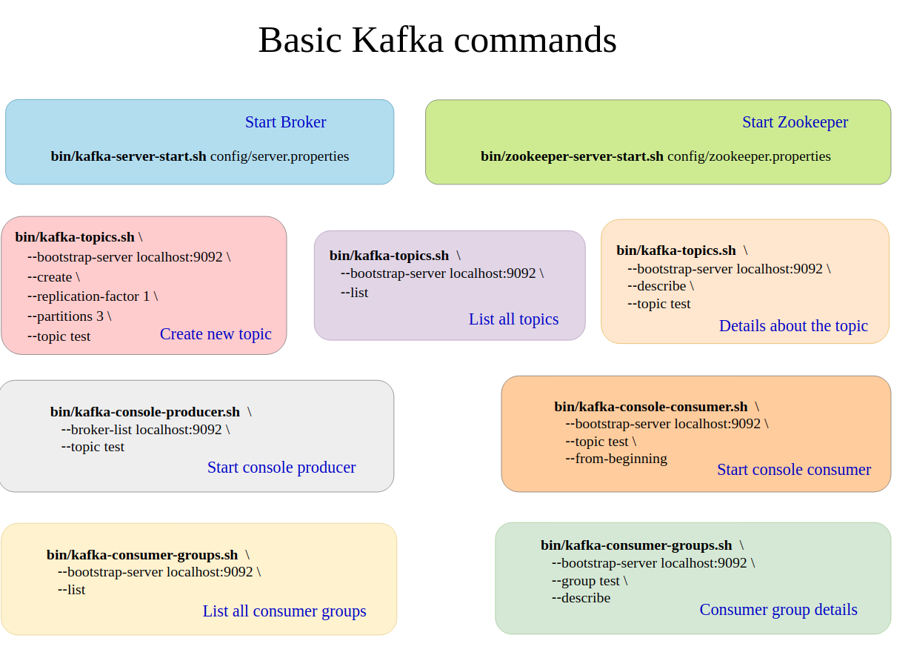
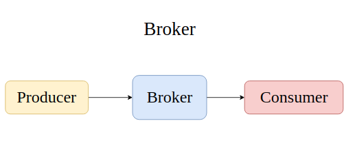
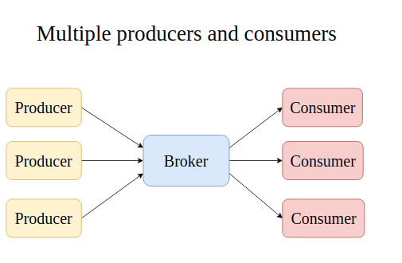
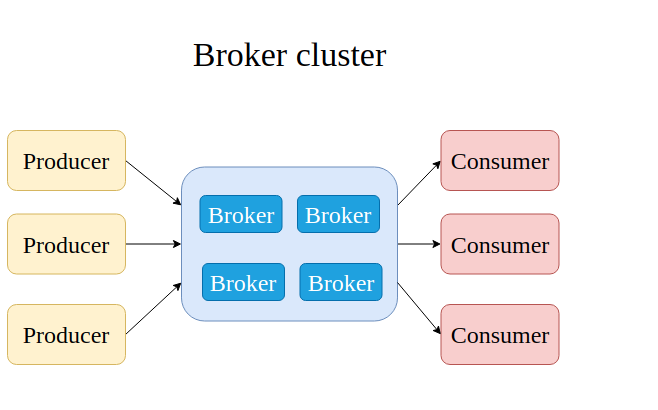
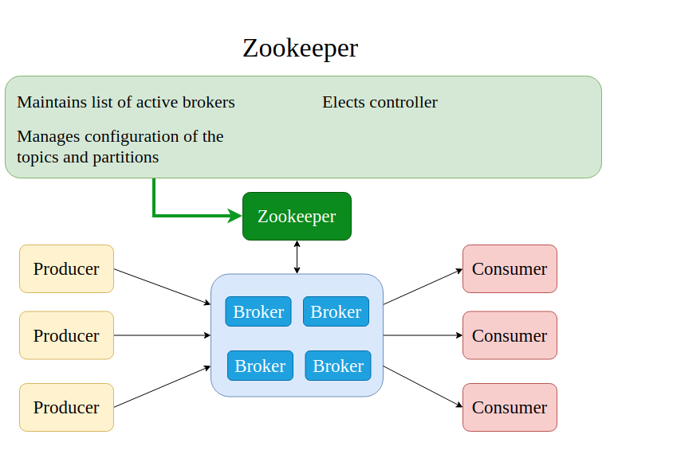
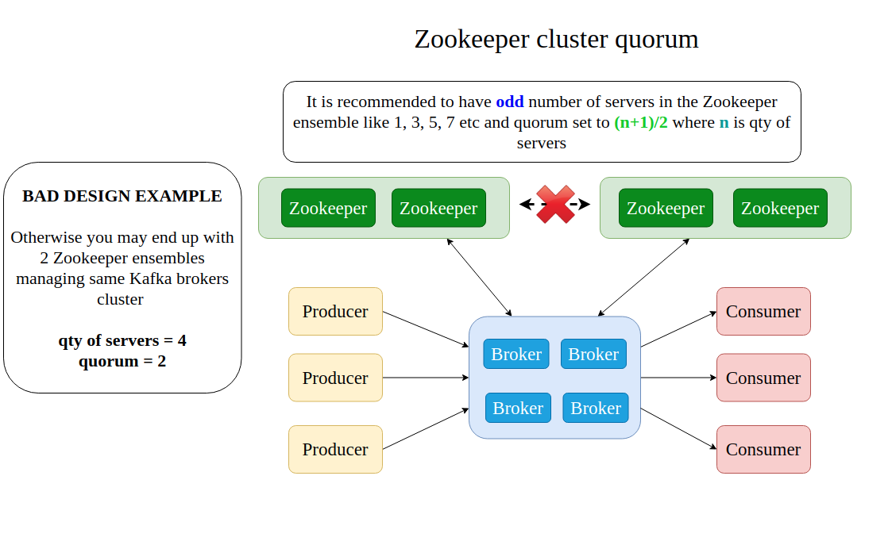
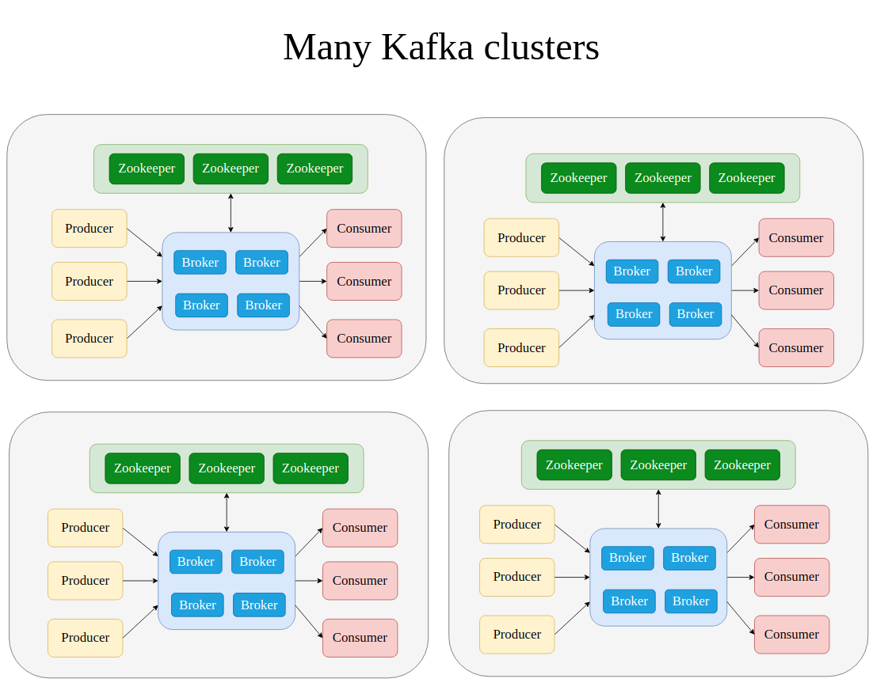
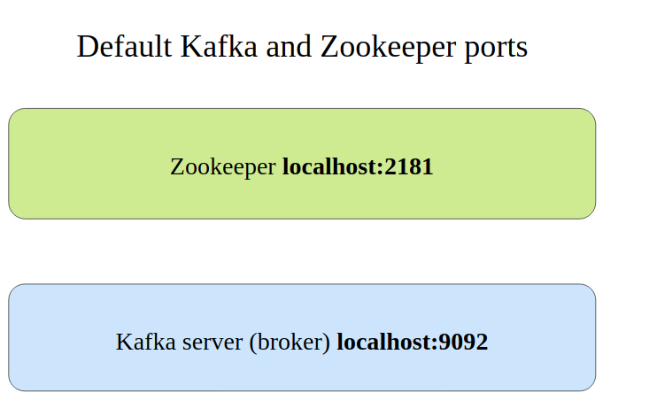
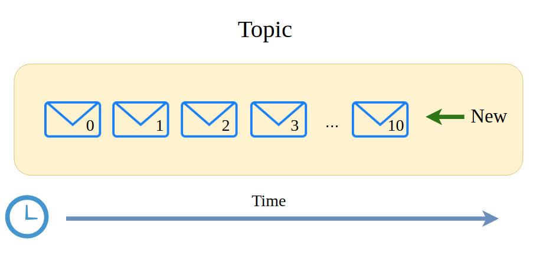

## What is Apache Kafka

YouTube is an example of publish-subscribe messaging system

## Some Basic Commands of Apache Kafka

## Apache Kafka Broker

In every publish subscribe system, message should be stored somewhere. Publishers should be able to send messages and consumers should be able to receive those subscribed messages.

Brokers are responsible for all of these. Publishers in Apache Kafka are called producers and subscribers are called Consumers. There are can multiple Kafka brokers working indepedently. Kafka brokers stores messages in files in hard-drives. There can be multiple producers and multiple consumers as below. 

These Producers and Consumers, produce and receive messages simultaneously. This also makes the Broker single point of failure, if the broker fails then producers and consumers message interaction will not work

Therefore Broker clusters are used.

## Broker Cluster

Multiple Producers and Multiple Consumers can interact with different brokers inside the Broker cluster

One producer can send messages to multiple brokers and hence each  of the broker can store part of the messages

How does the Broker Synchronize and Communicate amongst themseleves inside a Broker Cluster?

## Zookeeper

There is just a single controller in a kafka cluster

## Zookeeper Cluster (ensemble)

It is recommended to have odd number of servers in a zookeeper ensemble.
In every zookeeper cluster, we setup something called quorum , which is the minimum number of servers that should be up and running in order to form operational cluster.

## Multiple Kafka Clusters

Every cluster is a separate entity, however it is possible to have data synchronization between different Kafka Clusters

## Defaiult Kafka and Zookeeper Ports

If multiple zookeepers servers are running on a single computer, three different ports are needed and the same cab be specified by adjusting the configuration files

Same relates to Kafka Brokers

If Brokers should be publicly accessible, we need to adjust "advertised.listeners" property in Broker Config.

## Kafka Topic

Messages are stored by Kafka Brokers by topic. Every topic must have a unique name. Every topic must have a unique name in a kafka cluster.

Every message inside a topic must have a unique number called offset.

